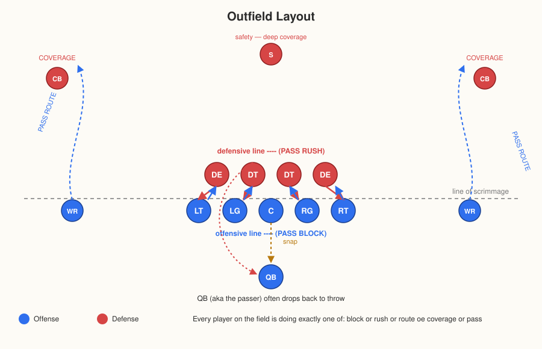
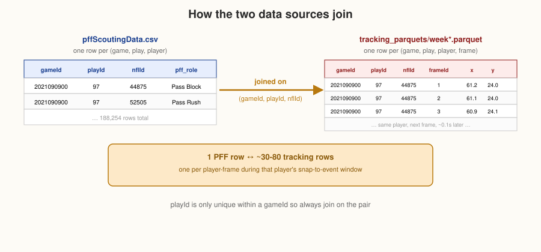

## Basic how it works:
Things to keep in mine:

* The game consists of discrete plays. 
* Two teams with 11 players each line up facing each other then

  * One team has the ball (**offense**)
  * The other team tries to take it away or stop its progress (**defense**)

* A play starts with the **snap** — the center or an offensive player passes the ball backward between his legs to the quarterback and ends a few seconds later when the play is whistled dead (tackle, ball goes out of bounds, pass falls incomplete, score).
* The field is 100 yards of playing field plus a 10-yard **end zone** at each end (120 yards total), and about 53 yards wide. The offense has **4 downs** (attempts) to advance the ball 10 yards; if they succeed, they get a fresh set of 4 downs.
* On any given play, the offense either **runs** the ball (hands it to a runner) or **passes** it (the QB throws it downfield)

  

## Dataset review.

* Dataset was extracted from https://www.kaggle.com/datasets/dmay01/usefuldata

  It only has the following files:
  - pffScoutingData.csv
  - team_information.csv
  - tracking_parquets/week1.parquet ... week8.parquet

  How the two files relate to each other

  

  
  

  `pffScoutingData.csv` and the tracking parquet files describe the *same plays* from two different
  perspectives:

  - `pffScoutingData.csv` is **one row per (game, play, player)** — a human's judgment of what that
    player did and how well it worked. It has no sense of time within the play.
  - The tracking parquets are **one row per (game, play, player, 1/10th-of-a-second frame)** — the raw
    (x, y) position, speed, acceleration, etc. of every player, 10 times a second, for the whole play.

Furthermore:

* The dataset only contains **pass plays**.
* Every play in this data follows the same basic shape:

  1. **Snap** — the center hikes the ball to the QB.
  2. **Pass protection** — while the QB looks to throw, 5 offensive linemen try to stop defenders from reaching him. This is called **pass blocking**.
  3. **Pass rush** — the defenders trying to reach and tackle the QB before he throws are **pass rushing**.
  4. **Routes and coverage** — meanwhile, offensive receivers run prescribed paths (**routes**) to get open for a catch, while defensive backs try to stay attached to them (**coverage**).
  5. **Resolution** — the QB throws the ball (completed, incomplete, or intercepted), or a pass
    rusher reaches him first (sack), or he scrambles (runs with it himself).

* Every player on the field is doing exactly one of those things on a pass play either pass blocking, pass
rushing, running a route, or playing coverage (plus the QB, who is just technically "passing").
* That's the taxonomy which was used to label every player on every play in `pffScoutingData.csv`

## Positions found in dataset

 1. **Offensive line**
 2. **Left Tackle (LT)**, 
 3. **Left Guard (LG)**, 
 4. **Center (C)**, 
 5. **Right Guard (RG)**,  
 6. **Right Tackle (RT)**. 
  
    - Tight ends (TE) and running backs (HB/FB) sometimes help block too

7. **Defensive pass rushers**: defensive ends or tackles (**DE, DT, DLT, DRT, LEO, REO, NT, and the list goes on** and sometimes linebackers rushing instead of dropping into coverage (a **blitz**).

* **Everyone else**:

  8. **wide receivers (WR)**
  9. **tight ends (TE)** run routes
  10. **cornerbacks (CB)**
  11. **safeties (S/FS/SS)** play coverage
  12. **the quarterback (QB)** is the passer.

## How I used dataset files:

I used the pffScoutingData.csv file to get the play-level judgment ("this blocker allowed a hurry") and 
reconstructing *what actually happened, physically, in those 2-3 seconds* from the raw tracking data
(how close did the rusher get? how fast were they moving? did the gap close over time?).

## How to classify plays or in other words "success" and "failure"

- **Pressure** — an umbrella term for the pass rush disrupting the QB before he can comfortably
  throw. It comes in three flavors, worst to mildest:
  - **Sack** — a pass rusher tackles the QB *behind the line of scrimmage* before he throws. Worst
    outcome for the offense: loss of yardage and the down is used up.
  - **Hit** — the QB is hit (often right as or just after he throws) but isn't sacked.
  - **Hurry** — the QB is forced to rush, step up, or alter his throw because a rusher got close,
    without being hit or sacked. The mildest form of pressure, but still a defensive win.
- From the **blocker's side**, letting any of these three happen is a failure: the data has
  `pff_hitAllowed` / `pff_hurryAllowed` / `pff_sackAllowed` flags on blockers.
- From the **rusher's side**, causing any of these three is a success: the data has
  `pff_hit` / `pff_hurry` / `pff_sack` flags on rushers.
- **"Beaten"** (`pff_beatenByDefender`) is considered when a blocker lost his one-on-one
  matchup — a slightly broader/softer notion than the three flags above, since a blocker can be
  beaten even if the QB got the ball out before it turned into a hit/hurry/sack.

---
---
### Useful links

* [Dictionary of terminologies and columns](Dictionary.md)
* [Use Cases](UseCases.md)
* [Tracking Data System](TrackingCoordinates.md)