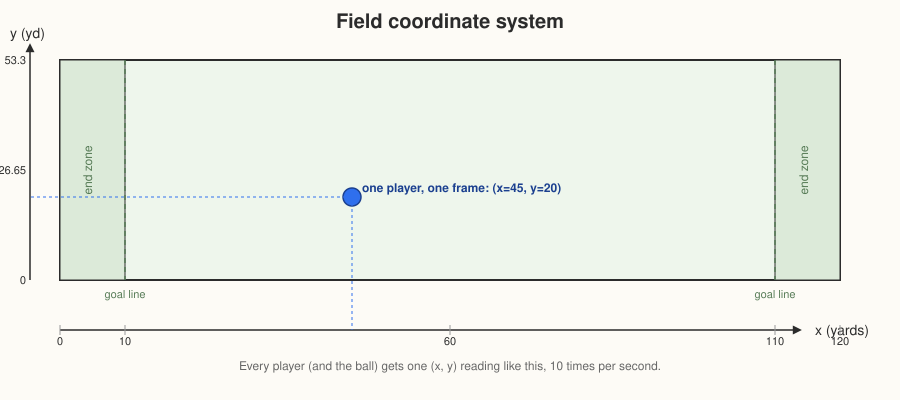
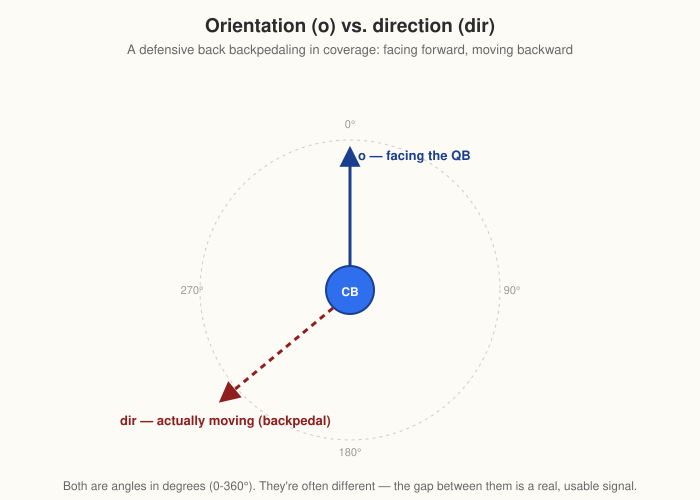
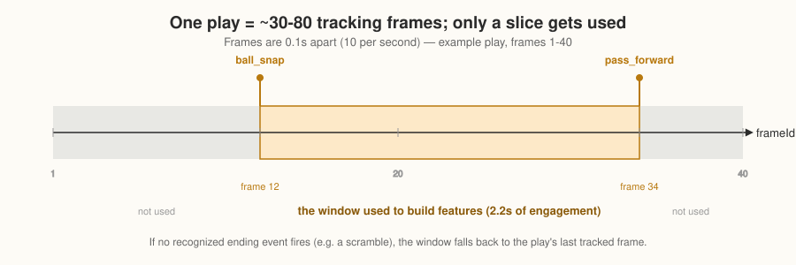
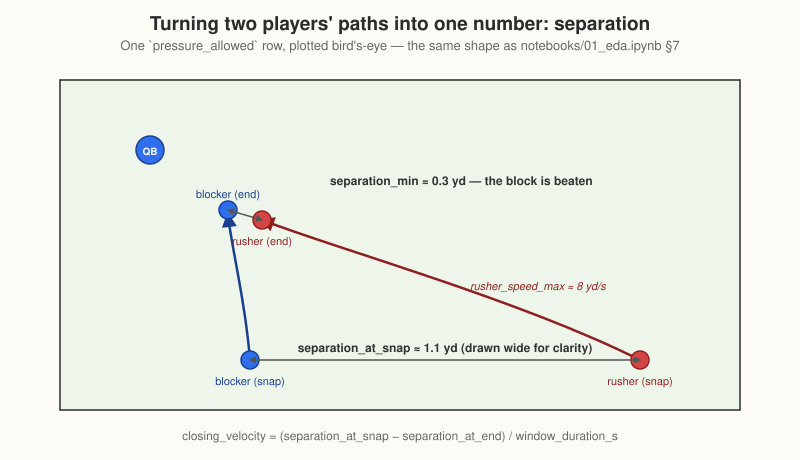

#### Tracking data coordinate system

Before building the models, I wanted to understand what the tracking data was actually giving me.

At first glance it looks simple: every player has an `(x, y)` position, speed, acceleration, orientation, and direction, recorded 10 times per second. The interesting part is what those numbers mean once I start looking at an entire play.

#### The field coordinate system

Every player, and the football, gets an `(x, y)` position in yards at 10 Hz.



`x` runs from 0 to 120 yards along the length of the field, including both end zones. `y` runs across the width, which is about 53.3 yards.

I do see values outside that `y` range — in the data I checked, from -2.61 to 57.01. Those are not necessarily bad values; they usually just mean the player has gone out of bounds and the tracking continues.

There is also `playDirection`, which tells me whether the offense is moving toward increasing or decreasing `x`. That matters because increasing `x` does not always mean "forward." For the features I am using now, I mostly work with relative distances and speeds, so I do not need to normalize everything by play direction. It matters more when I want to look at a play visually or calculate something relative to the field.


The basic movement variables are fairly intuitive:

* `s` is speed in yards/sec
* `a` is acceleration in yards/sec²
* `dis` is the distance traveled since the previous frame

The more interesting distinction is between `o` and `dir`.

`o` is where the player's body is facing.

`dir` is where the player is actually moving.

Those are not always the same thing.

A defensive back backpedaling is a good example. He can be facing the quarterback while moving backwards, so his `o` and `dir` point in different directions. A pass rusher changing direction can do the opposite: his movement direction can change quickly while his body orientation takes longer to follow.



That difference turned out to matter for the project. It is why something like `orientation_std` is not just another arbitrary feature. How much a player's facing angle changes during a play gives me useful information for problems like identifying `player_role` and `block_type`.

#### The football

One thing that is easy to miss when working with the raw tracking data is that the football gets its own row every frame.

Those rows look like:

```text
team = "football"
nflId = NaN
```

So not every tracking row is a player.

That is mostly a raw-data detail for me because those rows drop out naturally when I work with player IDs, but they are still there in the original tracking files.

## The real challenge is turning a whole play into one row

This is probably the most important part of the tracking data for the models.

A play is not one measurement. It is usually around 30–80 frames, roughly 3–8 seconds of movement.

I obviously cannot give all of those raw coordinates directly to a simple model as one player-play observation. I need to decide **which part of the play matters**, and then summarize what happened during that period.

For pass protection, the useful window starts at the snap and ends when the passing or pass-rush action is effectively over.

The tracking `event` field helps me find that point. It is `NaN` on most frames and only appears on notable events such as `ball_snap`, `pass_forward`, `qb_sack`, `qb_strip_sack`, `pass_tipped`, `fumble`, and so on.

So I use the first snap event as the start of the window, then the first appropriate ending event after it. If there is no recognized ending event — for example on a scramble — I fall back to the last tracked frame.

The point is to isolate the actual engagement:

```text
before snap → nothing to model yet

snap
   ↓
pass-protection / pass-rush movement
   ↓
pass / sack / end of tracked play
```



Once I have that window, I only keep the players relevant to the question.

For example, for `pressure_allowed`, I care about the blocker and the rusher they are matched against.

Then I turn all those frames into a small set of summary measurements.

Things like:

* how far apart they were at the snap
* the closest they ever got
* how quickly that gap closed
* the rusher's average or maximum speed

That is the basic transformation behind the whole project:

```text
many tracking frames
        ↓
find the relevant part of the play
        ↓
keep the players that matter
        ↓
summarize their movement
        ↓
one row for the model
```

## A concrete example

For one `pressure_allowed` matchup, suppose the blocker is `nflId=44875` and the rusher is `nflId=52505` on play `(gameId=2021090900, playId=97)`.

Imagine the snap is at frame 12 and `pass_forward` happens at frame 34. At 10 Hz, that gives me a 2.2-second window.

During that window, I might see:

```text
separation_at_snap = 1.1 yards
separation_min     ≈ 0.3 yards
rusher_speed_max   = 8.0 yd/s
```

That gives a simple summary of the interaction:

```text
closing_velocity = (1.1 - 0.3) / 2.2
                 ≈ 0.36 yd/s
```

The model never needs to see every raw coordinate. It gets the compact description of what happened between the two players.



## What I am really doing with the tracking data

The tracking data starts as a continuous stream of movement.

I am turning that stream into a description of the interaction that I actually care about.

That is why the final features are things like separation, displacement, speed, acceleration, orientation variability, and closing velocity. This to me are my way of compressing several seconds of movement into something that represents what happened during the play.

The exact players and measurements change depending on the problem, but the idea stays the same:

**find the relevant part of the play, isolate the relevant players, and turn their movement into measurable behavior.**

That is the bridge from the raw tracking data to the models I am building.
